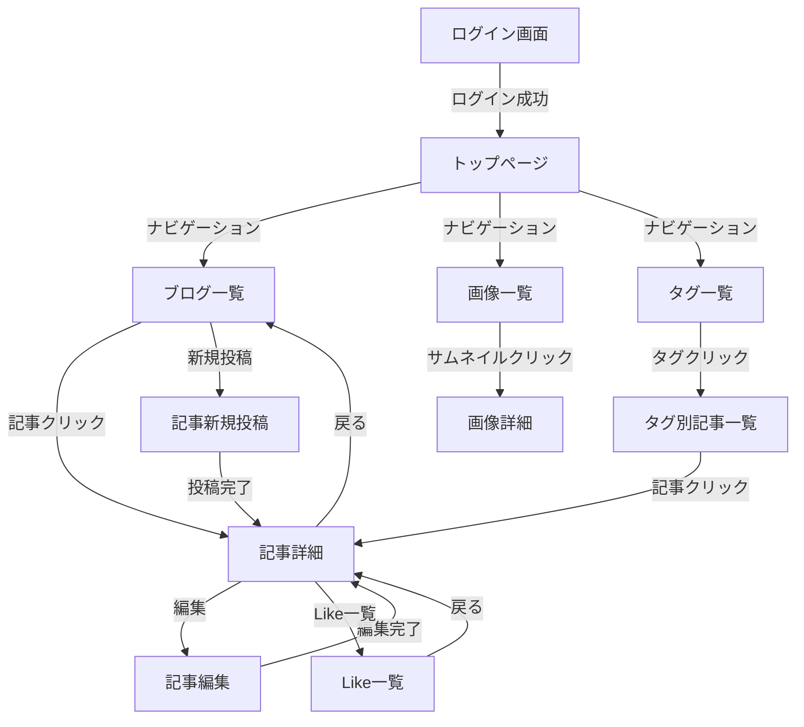

# 画面遷移図

```mermaid
graph TD
    Login[ログイン画面]
    Top[トップページ]
    Blogs[ブログ一覧]
    BlogDetail[記事詳細]
    BlogNew[記事新規投稿]
    BlogEdit[記事編集]
    BlogLikes[Like一覧]
    Images[画像一覧]
    ImageDetail[画像詳細]
    Tags[タグ一覧]
    TagBlogs[タグ別記事一覧]

    Login -- ログイン成功 --> Top
    Top -- ナビゲーション --> Blogs
    Top -- ナビゲーション --> Images
    Top -- ナビゲーション --> Tags
    Blogs -- 記事クリック --> BlogDetail
  Blogs -- 新規投稿 --> BlogNew
  BlogNew -- 投稿完了 --> BlogDetail
  BlogDetail -- 編集 --> BlogEdit
  BlogEdit -- 編集完了 --> BlogDetail
    BlogDetail -- Like一覧 --> BlogLikes
    BlogDetail -- 戻る --> Blogs
    BlogLikes -- 戻る --> BlogDetail
    Images -- サムネイルクリック --> ImageDetail
    Tags -- タグクリック --> TagBlogs
    TagBlogs -- 記事クリック --> BlogDetail
```

- 未ログイン時はどの画面からもログイン画面へ遷移します。
- 実装上の画面URL例：
  - /login, /, /blogs, /blogs/[id], /blogs/new, /blogs/[id]/edit, /likes?blogId=, /images, /images/[id], /tags, /tags/[id]
